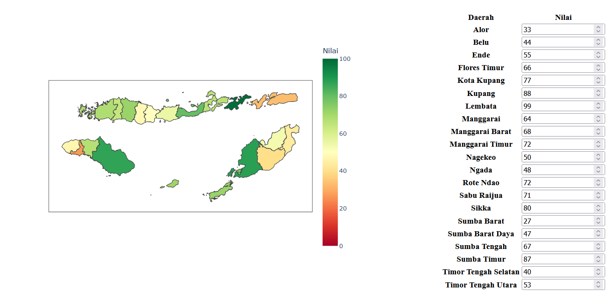

# Dash-Based NTT Visualization

Dash-Based NTT (_Nusa Tenggara Timur_) Visualization is a simple app based on [Dash](https://dash.plotly.com/) Python framework to easily create map visualization, or choropleth. You can also save it to PNG file.

## Setup
1. Install [Python](https://www.python.org/).
2. (Recommended) Activate virtual environment. Here is the command example:
    - `pip install virtualenv`
    - `py -m venv ./venv`
    - `venv\Scripts\activate`
3. `pip install -r requirements.txt`

## How to Start
1. `py app.py`
2. Open [`http://127.0.0.1:8050/`](http://127.0.0.1:8050/) in any browser.

## Dependencies
- NTT GeoJSON: [GADM (Database of Global Administrative Areas)](https://gadm.org/)
- Visualizer main dependency: [Dash](https://plotly.com/dash/)
